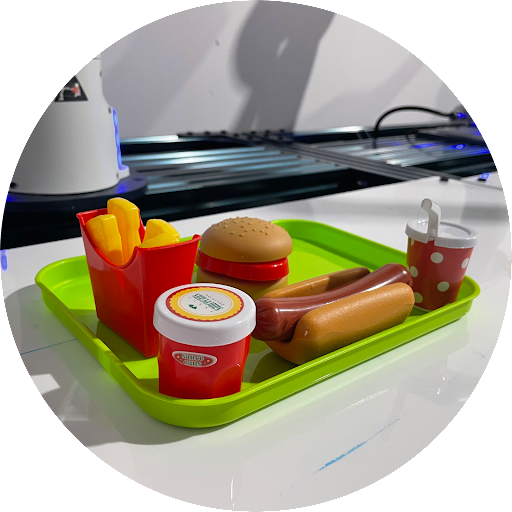

# Sandwich-Making Robot using a Franka Emika Robot Arm

- In this project, I used an Azure Kinect RGBD camera and Franka Emika robot arm to detect toy sandwich ingredients and then manipulate them in order to make a toy sandwich.
- [Link to Full Video](https://drive.google.com/file/d/1rLvZu4eQSc6O5v0aBRKd64w3CsT2q0uD/view?usp=drive_link)

  

## Approach
1. Detect and localize sandwich ingredients in the camera frame using Microsoft Azure RGBD camera (using standard CV techniques for pre-processing).
2. Apply pre-computed transform from camera to end-effector to get ingredient coordinates in robot base frame.
3. Use a state-machine to stack ingredients in the correct order to make a sandwich and then reset the process.   

## Media

